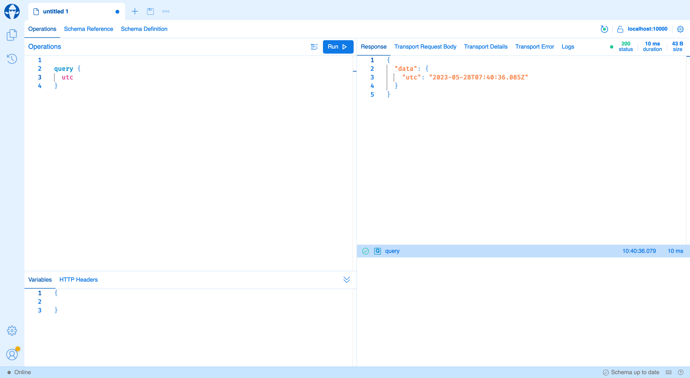

In this article, I want to showcase a new way to create web APIs with GraphQL. We will look at its benefits compared to traditional REST API, and how we can transform existing REST API to support GraphQL.

# Over and under fetching

First of all, we need to figure out what issues we can have with the REST APIs and how GraphQL can help solve them. The main two issues would be under-fetching and over-fetching. They are common when we are working with REST APIs. Under-fetching occurs when an initial API request doesn't supply enough data, forcing the application to make additional requests. Over-fetching, on the other hand, happens when an API request returns more data than the client needs.

Consider a scenario where a developer works on a user profile that needs to load user personal information (e.g., name, email, and profile picture) and user roles (e.g., admin, subscriber, etc.). In a traditional RESTful approach, fetching this data could require at least two different endpoints: one for personal information and another for roles.

If you fetch from the personal information endpoint and it doesn't include the user roles, you've been under-fetched and must make an additional request to the roles endpoint. Conversely, if the personal information endpoint returns all available data about a user—including details not needed for the current view—you've over-fetched, wasting bandwidth and potentially slowing down the application.

The GraphQL helps to solve this issue rather easy. Instead of having multiple endpoints, there's a single endpoint that accepts queries. These queries define exactly what data the client needs, eliminating under-fetching. The client can request different data types in a single request.

Let's look at our user profile example. Instead of making separate requests for personal information and roles, we can make a single GraphQL query:
``` graphql
query {
  user(id: 1) {
    name
    email
    profilePicture
    roles {
      title
    }
  }
}
```

This query asks for specific fields (name, email, profilePicture, and roles) for the user with an id of 1. The server will return a JSON object that mirrors the shape of the query and includes just the requested fields.

The flexibility of GraphQL queries also solves the problem of over-fetching. Because the client specifies exactly what data it needs, the server will never send unnecessary data. Using our example, if we don't need the user's profile picture for a certain view, we can simply leave it out of the query:
``` graphql
query {
  user(id: 1) {
    name
    email
    roles {
      title
    }
  }
}
```

In this query, the server will not send the profile picture, even if it's available. 

# Key differences with REST

## Query

GraphQL's strict protocol is an essential part of its power and is a key distinction from REST APIs, where conventions can vary significantly. Nowadays, all major tech companies have their own REST best practices that sometimes can be completely incompatible.

At the same time, GraphQL APIs are organized in terms of types and fields, not endpoints. GraphQL uses a strong type system to describe the capabilities of an API and all the types of data it can return, enabling developer tools and ensuring the APIs behave in predictable ways.

Here is an example how the schema may look:
``` graphql
type Query {
  users(page: Int!, size: Int!): [User!]!
  user(id: Int!): User
}

type Mutation {
  createUser(name: String!, email: String!): User!
}

type Role {
  id: Int!
  name: String!
}

type User {
  id: Int!
  name: String!
  email: String!
  roles: [Role!]!
}
```

## Versioning

Versioning is an essential aspect of maintaining APIs, especially when the API undergoes significant changes. In traditional REST APIs, versioning often involves either changing the URL of an endpoint or including a version number in the request header. This approach has the downside of potentially breaking the application for any clients not updated to use the new version of the API. However, GraphQL takes a fundamentally different approach to versioning, helping avoid the issues associated with traditional versioning methods. 

Instead of creating new versions of the entire API, developers can simply extend the existing GraphQL schema with new fields to support new functionality. Clients that haven't been updated to understand these new fields will just ignore them, and the API remains backward compatible.

In case when we need to remove a field, GraphQL supports deprication, which signals to developers that a field is no longer in use and will be removed in the future. Even after a field is deprecated, it still works, so clients using that field will not break immediately. This provides time for clients to transition away from the deprecated field.

The strong type system in GraphQL helps to ensure that changes are compatible with existing queries. It prevents incompatible changes like altering the type of a field.

In essence, GraphQL's approach to versioning avoids the need for version numbers and breaking changes. It's more flexible and forgiving, and it lets developers add new features to an API without disrupting existing users. As a result, API evolution becomes a smoother process, fostering a better developer experience and ensuring more reliable applications.

## Client Generation

In GraphQL, client generation leverages the API schema and introspection feature. Given that the GraphQL schema is strongly typed and the types and relationships are well defined, it's possible to use this information to automatically generate client code. The client can be in various languages like TypeScript, C#, etc. It reduces the amount of boilerplate code that developers need to write, saving time and minimizing the risk of manual coding errors. 

Client generation works harmoniously with GraphQL's field deprecation semantics. When a field is deprecated, it can still be included in the schema and the generated client code, but it's marked as deprecated.

Developers can see the deprecation warning directly in their IDE while they're coding. This helps them move away from using deprecated fields in a smooth and controlled manner. Over time, as developers stop using the deprecated field, it can be safely removed from the schema without breaking any clients.

# Converting existing REST API into GraphQL API

## Initial setup

Now let's look at how we can convert existing REST API into GraphQL API. 
The initial endpoints look like that:
``` csharp
app.UseEndpoints(
    o =>
    {
        o.MapSwagger();
        o.MapGet("/users", 
            async (int page, int size, UserService service) => await service.GetUsers(page, size));
        
        o.MapGet("/users/{id}",
            async (int id, UserService service) => await service.GetUser(id));
        
        o.MapGet("/users/{id}/roles",
            async (int id, RoleService service) => await service.GetRolesByUserId(new[] { id }));
        
        o.MapPost("/users", 
            async (UserCreationRequest request, UserService service) => await service.CreateUser(request.Name, request.Name));
    });
```

> The article contains only selected source code to be short.
> If you want to see the full source code go to the demo repository https://github.com/byme8/DemoGraphQL
> There are two branches:
> - master - contains initial REST API
> - graphql - contains final GraphQL API

Endpoints that handle the page from the under-fetching and over-fetching example. The first thing you need to do is to install `` HotChocolate.AspNetCore `` Nuget package. 
``` bash
dotnet add package HotChocolate.AspNetCore
```

The `` HotChocolate `` is a set of tools that allows us to receive and process GraphQL queries. It has a nice integration with the AspNet Core pipeline. The full documentation can be found [here](https://chillicream.com/docs/hotchocolate/v13).

Now bootstrap GraphQL server:
``` csharp
+ services
+    .AddGraphQLServer()
+    .AddQueryType<Query>();

// ...

app.UseEndpoints(
    o =>
    {
+       o.MapGraphQL();
        o.MapSwagger();
        o.MapGet("/users", 
            async (int page, int size, UserService service) => await service.GetUsers(page, size));
// ...
+ public class Query 
+ {
+   public DateTimeOffset Utc() => DateTimeOffset.UtcNow;
+ }  
```
When we launch our application, we can access the GraphQL endpoint `` http://localhost:1234/graphql ``. If opened via the browser, we will see a GraphQL IDE. Here we can check the GraphQL schema and execute requests.



The initial setup is ready, and we can start to transform our REST APIs.

## Creating queries

Let's transform the next endpoint first:
``` csharp
        o.MapGet("/users/{id}",
            async (int id, UserService service) => await service.GetUser(id));
```

To do it we can just create a new method in our `` Query `` class:
``` csharp
public class Query 
{
  public DateTimeOffset Utc() => DateTimeOffset.UtcNow;

+ public Task<User?> GetUser(int id, [Service] UserService userService)
+   => userService.GetUser(id);
}  
```
Done! If we open our GraphQL IDE and check GraphQL schema, it would look like that:
``` graphql
type Query {
  utc: DateTime!
  user(id: Int!): User
}

type User {
  id: Int!
  name: String!
  email: String!
}
```

The `` HotChocolate ``automatically detects what types are exposed and add them to the schema.

Let's move on and transform another endpoint. However, do it a bit differently. We can still add it to the `` Query `` class, but placing everything into one class is not a great idea. We can split it to look very close to what we have when using controllers from `` AspNet Core ``.

To make it work, create a new class `` UserQueryExtensions `` and define new "endpoints" there. Moving further, I will use the "GraphQL field" definition to indicate the equivalent to "REST endpoints", but for GraphQL. 

It will look like this:
``` csharp
 services
    .AddGraphQLServer()
    .AddQueryType<Query>()
+   .AddTypeExtension<UserQueryExtensions>();

// ..
public class Query 
{
  public DateTimeOffset Utc() => DateTimeOffset.UtcNow;

- public Task<User?> GetUser(int id, [Service] UserService userService)
-   => userService.GetUser(id);
}

+ [ExtendObjectType(typeof(Query))]
+ public class UserQueryExtensions
+ {
+     public Task<IEnumerable<User>> GetUsers(int page, int size, [Service] UserService userService)
+         => userService.GetUsers(page, size);
+     
+     public Task<User?> GetUser(int id, [Service] UserService userService)
+         => userService.GetUser(id);
+ }
```

Here we created a class that extends another GraphQL type. In our case, it is a root type `` Query ``. Also, I moved user related GraphQL field from the `` Query `` and added it to a new extension. Pay attention to the configuration section at the beginning. You have to add these extensions to the setup manually. Otherwise, the `` HotChocolate `` would not detect it.

Now the GraphQL schema will have the following look;
``` graphql
type Query {
  utc: DateTime!
+ users(page: Int!, size: Int!): [User!]!
  user(id: Int!): User
}

type User {
  id: Int!
  name: String!
  email: String!
}
```

As you can see, from the GraphQL persective, there is only one thing that changed. Now, we have a new GraphQL field. It is exactly what we wanted. 

## More complex type extending

Let's add roles to our GraphQL schema. The initial REST endpoint looks like this:
``` csharp
        o.MapGet("/users/{id}/roles",
            async (int id, RoleService service) => await service.GetRolesByUserId(new[] { id }));
```

We can do this in two ways. First one more REST-like way. We just created another GraphQL field that will return a list of roles for a specific user. The schema would look like this:
``` graphql
type Query {
  utc: DateTime!
  users(page: Int!, size: Int!): [User!]!
  user(id: Int!): User
+ userRoles(userId: Int!): [Role!]!
}

type User {
  id: Int!
  name: String!
  email: String!
}

+ type Role {
+  id: Int!
+  name: String!
+ }
```

But there is a GraphQL way. We can extend the `` User `` type itself. So, when we request a user, we can fetch additional user roles. In this case, we will have the next GraphQL schema:
``` graphql
type Query {
  utc: DateTime!
  users(page: Int!, size: Int!): [User!]!
  user(id: Int!): User
}

type User {
  id: Int!
  name: String!
  email: String!
+ roles: [Role!]!
}

+ type Role {
+  id: Int!
+  name: String!
+ }
```

Let's do it to support the second way. To make it work, we need to create another extension class. However, we will extend the `` User `` type, not `` Query ``:
``` csharp
[ExtendObjectType(typeof(User))]
public class UserRolesQueryExtensions
{
    public async Task<Role[]> GetRoles([Parent] User user, [Service] RoleService roleService)
    {
        var rolesByUserId =  await roleService.GetRolesByUserId(ids);
        return rolesByUserId[user.Id];
    }
}
```

This setup allows us to build the next query from the "under and over fetching" example:
``` graphql
query GetUserProfile($userId: Int!) {
  user(id: $userId) {
    id
    name
    email
    roles {
      id
      name
    }
  }
}
```

But how it works? The GraphQL server receives the request mapped to proper GraphQL extensions. Here it would be two of them - the `` GetUser `` and `` GetRoles ``. The first extension would be executed, and its result would be passed to the second one. In the end, we have one request from the client and the GraphQL server that executed two GraphQL fields. As a result, the client will receive the final result faster because everything happens locally on the server, which is much closer to a database.

However, there is one issue with such an approach. Let's have a look at the next query:
``` graphql
query GetUsers($page: Int!, $size: Int!) {
  users(page: $page, size: $size) {
    id
    email
    roles {
      id
    }
  }
}
```
Here we have a GraphQL field that returns a list of items. Then for each item, we have an extension. If we keep everything as we have right now, it can be a disaster.

Let's analyze what is happening:
1. GraphQL server executes `` GetUsers `` GraphQL field and gets 5 items.
2. GraphQL server executes `` GetUserRoles `` GraphQL field for 1st item.
3. GraphQL server executes `` GetUserRoles `` GraphQL field for 2nd item.
4. GraphQL server executes `` GetUserRoles `` GraphQL field for 3rd item.
5. GraphQL server executes `` GetUserRoles `` GraphQL field for 4th item.
6. GraphQL server executes `` GetUserRoles `` GraphQL field for 5th item.
7. GraphQL server returns the final result.

As you can see, it can be an issue when the `` GetUserRoles `` goes to a database for every item. It can make performance really bad.
To fix this issue, the GraphQL server has a feature called data loaders. They allow you to batch GraphQL field execution and get data in one go. Here is how improved `` GetUserRoles `` would look like:
``` csharp
[ExtendObjectType(typeof(User))]
public class UserRolesQueryExtensions
{
    public async Task<Role[]> GetRoles(
        IResolverContext context,
        [Parent] User user, [Service] RoleService roleService)
    {
        return await context.BatchDataLoader<int, Role[]>(async (ids, ct)
            => await roleService.GetRolesByUserId(ids))
            .LoadAsync(user.Id);
    }
}
```
It creates an instance of batch data loader on the first call and adds the current id to a list. Then for every subsequent call, we just remember user ids. When we have the full list of user ids, it calls a lambda with those user ids, and we can just get user roles for all users at once. so, the log would look like this:
1. GraphQL server executes `` GetUsers `` GraphQL field and gets 5 items.
2. GraphQL server executes `` GetUserRoles `` GraphQL field that creates batch data loader and passes id of the 1st item.
3. GraphQL server executes `` GetUserRoles `` GraphQL field that passes id of the 2nd item.
4. GraphQL server executes `` GetUserRoles `` GraphQL field that passes id of the 3rd item.
5. GraphQL server executes `` GetUserRoles `` GraphQL field that passes id of the 4th item.
6. GraphQL server executes `` GetUserRoles `` GraphQL field that passes id of the 5th item.
6. GraphQL server executes data loader.
7. GraphQL server return final result.

Full documenation can be find [here](https://chillicream.com/docs/hotchocolate/v13/fetching-data/dataloader).

## Creating mutation

Another small thing about the GraphQL. You maybe forgot, but there was another endpoint:
``` csharp
        o.MapPost("/users", async (UserCreationRequest request, UserService service) 
              => await service.CreateUser(request.Name, request.Name));
```

Semantically it has a different meaning compared to previous endpoints. It is a mutation operation that creates a new entity. The GraphQL draws a line between read and edit operations. All read operations have to be defined in `` Query `` type, and all edit operations have to be defined in `` Mutation `` type. So, defining this endpoint as a mutation would be a good idea.

Here is how we can do it:
``` csharp
services
    .AddGraphQLServer()
    .AddQueryType<Query>()
+   .AddMutationType<Mutation>()
+   .AddTypeExtension<UserMutationExtensions>();

// ...

public class Mutation
{

}

// ...

[ExtendObjectType(typeof(Mutation))]
public class UserMutationExtensions
{
    public Task<User> CreateUser(string name, string email, [Service] UserService userService)
        => userService.CreateUser(name, email);
}
```

It is the same approach as with the `` Query `` type, but now we have the `` Mutation `` type as a root type.


# Conclusion

In the beginning, we had a brief look at the reasons why GraphQL was developed. Under-fetching and over-fetching are common challenges with traditional RESTful APIs, potentially leading to inefficiencies and poor user experiences. GraphQL offers a way how to avoid it, allowing clients to specify precisely what data they need, reducing unnecessary requests and data transfer. This flexibility optimizes performance and bandwidth usage, making GraphQL a compelling choice for modern web development.

In the second part, we had a look on how to set up GraphQL server. We figured out how to create GraphQL fields and what we need to consider when transforming existing REST endpoints into GraphQL fields. 

I hope you find this article useful. In the next time, we will look at how to do integration testing of our GraphQL APIs.
